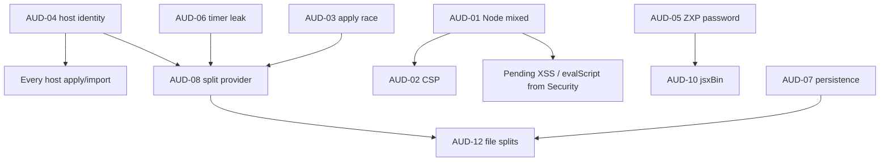

# PROJECT AUDIT — Spunkram Library CEP (interim)

**Target:** [nipapin/spunkram-library](https://github.com/nipapin/spunkram-library) · panel `com.spunkramlibrary.cep` · v0.9.12  
**Date:** 26 Aug 2026  
**Status:** INTERIM v1.5 — 6 / 10 specialists have filed. Reliability complete (24/24). Remaining reports merge into v2.

**Sources in this pass**
- Security Specialist — partial (Node/CSP/ZXP; still on evalScript, tokens, pack-install)
- Code Quality / Maintainability — partial (God files, persistence, host-id; still on unused exports / duplication)
- React + TypeScript — partial (`ConfigurationWrapper` only; still on hooks / CaptionsTab / StyleTab / host sdk)
- Testing Engineer — complete (gaps pass on public main; no clone)
- Integration / Boundary Tester — complete (12 issues, 6 high; host package not in tree)
- Error Handling / Reliability — complete (24/24: JSX-001..010 + CEP-001..014)

**Not in yet:** Lead Architect, CEP, ExtendScript, Performance.


IDs below are synthesizer IDs. `real` = observed bug or shipped misconfig. `potential` = debt / attack surface without a demonstrated exploit in this pass.

---

## 1. Executive Summary

The panel is a Bolt CEP app (React 19, Vite, Context only) with Node mixed into the UI process. Three specialists independently hit the same shape: one giant configuration provider, three competing host-identity helpers, and a persistence layer that still writes old `aitools-cep-*` keys.

Highest-cost real bugs already on the table:

1. Host apply can silently stop updating styles if `evalScript` fails (`lastPushedProps` committed early).
2. AE 24–25 can be routed down the Premiere path because host id is resolved three different ways.
3. `--enable-nodejs` + `--mixed-context` + `child_process`/`fs`/`vm` in panel JS means any XSS is one step from disk/process.
4. Empty/dropped evalScript is treated as success (BND-01/03), so apply can report Applied when the host never ran.

Do not treat this as a full audit. CEP, in-tree JSX, error handling, performance, and integration have not reported.

Counts this pass: 4 critical/high real bugs plus broken CI/test infra (AUD-15). Duplicates: ConfigurationWrapper cluster. Confirmations: AUD-04 now has Testing T-CEP-03 as a second source.

---

## 2. Critical Issues

### AUD-01 — Node.js mixed into the UI context
- **Severity:** Critical
- **Kind:** real (shipped config)
- **Confidence:** high
- **Source:** Security
- **Location:** `cep.config.ts`, `src/js/lib/cep/node.ts`, `src/js/main/index.html`
- **Problem:** CEF flags `--enable-nodejs`, `--mixed-context`, `--allow-file-access`, `--allow-file-access-from-files`. `node.ts` re-exports `child_process`, `fs`, `net`, `vm` into panel code. `index.html` has no CSP.
- **Why:** Bolt CEP default. Node and Chromium share one JS world.
- **Impact:** XSS, hostile pack content, or a bad evalScript round-trip can read the disk or spawn a process with the user's OS rights.
- **Reproduction:** Inspect `cep.config.ts` CEF flags; from panel JS `require("child_process")` via the `node.ts` barrel.
- **Fix:** Drop `--mixed-context` if at all possible. Stop exporting `child_process` / `vm` / `net` from the UI barrel. Add a strict CSP. Keep Node only in a sandbox / extension helper if the host still needs fs.
- **Depends on:** AUD-02 (CSP reduces blast radius). InnerHTML / evalScript injection still pending from Security.

### AUD-02 — No CSP on the panel document
- **Severity:** High (clustered with AUD-01)
- **Kind:** real
- **Confidence:** high
- **Source:** Security
- **Location:** `src/js/main/index.html`
- **Problem:** No Content-Security-Policy.
- **Impact:** Inline script / unexpected origins are unrestricted; raises AUD-01 from "misconfig" to "easy RCE given XSS".
- **Fix:** CSP: default-src self, no inline if feasible, lock `eval`/data URLs. Re-test CEP load.

---

## 3. High Priority Issues

### AUD-03 — Caption style apply race
- **Severity:** High
- **Kind:** real bug
- **Confidence:** high
- **Source:** React + TypeScript
- **Location:** `ConfigurationWrapper.tsx` (`pushStyleValuesToHost` / `lastPushedProps` / `applyCaptionStyleValues`)
- **Problem:** `lastPushedProps` is written *before* `applyCaptionStyleValues` finishes. If evalScript fails, the delta thinks the host already has the new values. Later slider moves no-op.
- **Why:** Optimistic local cache, no success gate.
- **Impact:** Styles stop reaching AE/PPro after one failed evalScript. Looks like "sliders dead".
- **Reproduction:** Fail or timeout the host apply once, then move a style slider. Host stays on the last successful values.
- **Fix:** Commit `lastPushedProps` only after a successful host ack. On failure, keep the previous snapshot and surface the error.
- **Depends on:** BND-03 (empty eval reported Applied) and BND-01 (evalES never rejects). Error Handling still pending on swallowed catches.

### AUD-04 — Host identity resolved three times
- **Severity:** High
- **Kind:** real bug
- **Confidence:** high (Quality + Testing T-CEP-03 + Integration BND-05)
- **Source:** Code Quality; confirmed Testing and Integration
- **Location:** `bolt.ts` `cepHostAppId()`; `host-identity.ts` `getResolvedHostAppId()`; `hostSdk()` via `MotionFlow.host`
- **Problem:** Three helpers, three caches, three probes (DOM CompItem/renderQueue/sequences vs evalScript renderQueue/rootItem/BridgeTalk vs SDK). Call the wrong one in AE 24–25 and you take the Premiere path inside After Effects.
- **Impact:** Wrong SDK, wrong import/apply, silent no-ops on one host.
- **Fix:** One module, one cache, one probe order. Kill the other two. Add a host-id test matrix for AE 24/25 and PPro.
- **Depends on:** Architect + ExtendScript + Integration should confirm. Do not split files until this is one function.

### AUD-05 — ZXP password is the literal `password`
- **Severity:** High
- **Kind:** real
- **Confidence:** high
- **Source:** Security
- **Location:** packing / `cep.config.ts` (ZXP password)
- **Problem:** ZXP signed/packed with password `password`.
- **Impact:** Trivial unpack of the shipped extension; readable JSX (see AUD-10).
- **Fix:** Real secret from CI, not in git. Rotate. Treat old ZXPs as public.

### AUD-06 — Timer leak on style push / remote style sync
- **Severity:** High
- **Kind:** real bug
- **Confidence:** high
- **Source:** React + TypeScript
- **Location:** `ConfigurationWrapper.tsx` — `pushStyleValuesToHost` `setTimeout(40)`; `syncCaptionStyles({ checkRemoteUpdates: true })`
- **Problem:** Timeout not cleared on unmount. Remote sync not cancelled. CEP panel reload fires setState/evalScript on a dead provider.
- **Impact:** Errors after reload, duplicate host applies, leaked timers.
- **Fix:** Store timeout id, clear in `useEffect` cleanup. Abort remote sync on unmount.

---

## 4. Medium Priority Issues

### AUD-07 — Persistence has no single contract
- **Severity:** High/Medium (debt with real wrong-key writes)
- **Kind:** real
- **Confidence:** high
- **Source:** Code Quality
- **Location:** captions/chapters/config writers; `userdata-store.ts`; styles path
- **Problem:** Captions, chapters, and config still write hardcoded `aitools-cep-*` keys. Newer code uses branded `storageKey()`. Styles fall back to Chromium `localStorage`; everything else goes through `panelStore` (userdata JSON). Migration allowlists five prefixes: `motionflow`, `spunkram`, `spunkram-library`, `aitools-cep`, `gal-premiere`.
- **Impact:** Settings vanish across brand/rename; two sources of truth; migrate forever.
- **Fix:** One persistence helper. Branded keys only. Stop raw `localStorage` and `aitools-cep-*` writes. One-shot migrate.

### AUD-08 — `ConfigurationWrapper` is a God provider
- **Severity:** Medium (architecture) + perf
- **Kind:** potential / debt (real rerender cost)
- **Confidence:** high
- **Source:** Code Quality + React + TypeScript (same finding, merged)
- **Location:** `ConfigurationWrapper.tsx` (~868–870 lines)
- **Problem:** Caption grouping, style catalog, chapters language, host apply, and font sync share one Context. `value={{ ... }}` is a new object every render. `updateMode` / `selectPreset` / `addPreset` are not `useCallback`. Any `useConfiguration()` subscriber rerenders for all of it.
- **Impact:** Language change redraws the preset grid and vice versa. Every future feature in this file makes apply-race (AUD-03) and leak (AUD-06) worse.
- **Fix:** Split into caption-session / styles / chapters-prefs. Stabilize context value. After AUD-03 and AUD-06, not before.

### AUD-09 — `useConfiguration()` silent no-op outside provider
- **Severity:** Medium
- **Kind:** real
- **Confidence:** high
- **Source:** React + TypeScript
- **Location:** configuration context defaultValue
- **Problem:** Context created with `defaultValue`, so `if (!context)` is dead. Outside the provider you get silent no-op setters.
- **Fix:** `createContext(null)` and throw in the hook.

### AUD-10 — `jsxBin` off
- **Severity:** Medium
- **Kind:** potential (info disclosure)
- **Confidence:** high
- **Source:** Security
- **Location:** CEP pack config
- **Problem:** Host scripts stay readable in the ZXP. Combined with AUD-05, JSX is public.
- **Fix:** Enable jsxBin for shipping builds if you still care about hiding host scripts. Not a substitute for AUD-01.

### AUD-11 — Credits signaled by a magic window event
- **Severity:** Medium
- **Kind:** real (fragile contract)
- **Confidence:** high
- **Source:** Code Quality
- **Location:** three apps dispatch `aitools-credits-changed`; `ai-tools-panel` listens
- **Problem:** Stringly-typed global event. Rename in one place and the counter goes quiet.
- **Fix:** Store or callback, not `window` events. One module owns the name.

### AUD-12 — God files (line counts)
- **Severity:** Medium (maintainability)
- **Kind:** potential / debt
- **Confidence:** high on size; low on "must split this week"
- **Source:** Code Quality
- **Location:**
  - `CaptionsApp.tsx` 1020
  - `main.tsx` 1005
  - `ConfigurationWrapper.tsx` 868
  - `VoiceoverApp.tsx` 857
  - `transcribe.ts` 855
  - `cep-market.ts` 691
  - `auth-context.tsx` 666
  - `ChaptersApp.tsx` 665
  - `footage-grid.tsx` 640
  - `pack-install.ts` 625
  - `market-panel.tsx` 603
  - `captions.jsx` 1336
- **Problem:** Size, not a crash. `main.tsx` mixes pack scan, entitlements, generations accounting.
- **Fix:** After AUD-04 / AUD-07 / AUD-08. Highest leverage: split `main.tsx` pack/entitlements; split `ConfigurationWrapper`. Do not drive a rewrite from line count alone.

---

## 5. Low Priority Issues

### AUD-13 — Debug port 8860 in the shipped config
- **Severity:** Low / Medium
- **Kind:** potential
- **Confidence:** high that the flag exists; low on whether production builds keep it
- **Source:** Security
- **Location:** CEP debug config
- **Fix:** Debug only in non-prod. Confirm with CEP specialist whether 0.9.12 production ZXP still opens 8860.

### AUD-14 — `.env.production` / `qa-keys.js` are not secret leaks
- **Severity:** Info (negative finding)
- **Source:** Security
- **Notes:** `.env.production` is only `NODE_ENV=production`. `qa-keys.js` is QA checkbox ids. Do not file as a vuln.

---

## 6. Architectural Problems

Awaiting Lead Architect. From Quality + React, already:

- No domain boundaries: UI, persistence, host identity, pack install, and credits all leak into God modules.
- Persistence allowlist still names five historical products.
- Dual host stacks (Bolt DOM probe vs evalScript vs MotionFlow SDK).

Recommended (pending Architect): one host gateway, one persistence gateway, feature providers instead of one Configuration God-object.

---

## 7. React / TypeScript Problems

See AUD-03, AUD-06, AUD-08, AUD-09. Stack: React 19, Vite, Context only (no Zustand). Incomplete: hooks, `CaptionsTab`, `StyleTab`, host SDK wrappers.

---

## 8. CEP Problems

Awaiting CEP specialist. Security already covered Node flags, CSP, jsxBin, ZXP password, debug port. Do not double-count when CEP files.

---

## 9. ExtendScript Problems

Awaiting ExtendScript specialist. Testing: host JSX is not in this git tree (unpublished sibling rolled to dist). Quality listed captions.jsx at 1336 lines; treat as dist/workspace copy until ExtendScript confirms. Also T-HOST-01/02/03 (applyComp fixtures missing, work-area audio never returns, native plugins).

---

## 10. React to CEP to JSX Integration Problems

Source: Integration / Boundary Tester (complete). 12 issues, 6 high. Host JSX and motionflow-sdk are not in this repo; return shapes checked on the CEP side only.

Map: React talks to host via motionflow-sdk (cep-bridge.ts createCepBridge) or bolt.ts evalTS/evalES (CSInterface). Vite compiles motionflow-host to dist/cep/jsx/index.js. Large/unicode payloads are supposed to go through JSON sidecars; evalTS/evalES are still the actual pipe.

Highest leverage (Integration): one host RPC (sidecar + timeout + generation token + FIFO/coalesce) and one host-id cache; delete the other eval paths.

### High (real)

- BND-01 AUD-17 — bolt.ts evalES always resolve(res). EvalScript error, empty, and "undefined" count as success. Callers that .catch() (exportAeWorkAreaAudio.ts) never run. evalTS maps "" and "undefined" to resolve(undefined) on purpose. Host that returns nothing / alert / dropped callback looks successful.
  Fix: reject on EvalScript error, null, "" unless opted into sidecar-empty.

- BND-03 (strengthens AUD-03) — apply-item.ts composerStatusToOutcome: null/"" -> {ok:true}. Animator apply uses that. Combined with evalTS empty->undefined, a dropped host reply is reported Applied. applyPackItem checks result.applied; animator paths do not.
  Fix: only parsed sidecar {ok:true} is success. Same result.applied shape as applyPackItem.

- BND-02 AUD-18 — bolt.ts evalTS inlines JSON.stringify(arg) into ExtendScript. undefined becomes a hole/trailing comma (not ES3). NaN/Infinity become null. BMP unicode not escaped (why sidecars exist) but evalTS still ships raw Cyrillic.
  Fix: stop inlining; pass one JSON file path.

- BND-04 AUD-19 — 120s timeout only on createCepBridge().callHost. Premiere FULL_PROJECT is naked evalTS with no timeout. readWorkAreaAudioInfo same. AE drops callback during modal; UI hangs forever. Timeout does not cancel in-flight eval; late callback can still mutate after React moved on.
  Fix: every host call through one wrapper with timeout + generation token. Ignore stale callbacks.

- BND-05 (confirms AUD-04) — two independent host caches. host-identity caches first result forever. Failed/empty eval then JSON.parse throw permanently stores CSInterface fallback (often PPRO, known wrong in AE 24-25). CaptionsApp.isAfterEffects() uses cepHostAppId(); describeForExport uses isAfterEffectsAsync(); they can disagree. Once bad PPRO is cached, hostSdk() mitigation is dead.
  Fix: one probe, one cache, invalidate on reload. Never cache fallback from failed eval. Gate transcribe/apply on getResolvedHostAppId() after Motionflow.ready().

- BND-06 AUD-20 — no CEP-side evalScript queue. pushLiveEdit / pushHostResegment fire-and-forget. Typing/splitting overlap updates on the same mogrt. getCurrentTime 1.5s and getWorkRange 2s. ES serializes but React does not: stale replies apply after newer edits. Two withHostJsonFile applies poke the same host scheduleTask kick.
  Fix: FIFO or latest-wins coalesce in the bridge. Debounce live caption updates. Job ids on scheduleTask kicks.

### Medium

- BND-07 — App mounts immediately; initBolt (evalFile, host stamp, identity) runs after first paint. useWorkRangeCost polls getWorkRange on mount. Concurrent evalFile leaves the host namespace half-defined. Same race on flyout Reload.
  Fix: block host calls until boltInit / Motionflow.ready(). Single-flight JSX load, fail closed.

- BND-08 — any parsed object whose name contains "error" (case-insensitive) is rejected. {name:"Error overlay", applied:true} becomes a thrown Error. Conversely {ok:false, reason:"NO_ACTIVE_COMP"} has no name and resolves as success.
  Fix: explicit envelope only. Never sniff name.includes("error").

- BND-09 (confirms T-CEP-02) — two withHostJsonFile implementations. Bridge polls .result.json 3 min then unlinks payload+result in finally, including on timeout (host may still be writing). Caption version unlinks as soon as run() settles; if the eval callback fires before scheduleTask reads the file, NO_FILE. Sidecar JSON.parse failures swallowed as "host did not answer".
  Fix: one implementation. Unlink only after final sidecar parsed. Surface parse errors.

- BND-10 — CaptionsApp handleLoad empty catch: eval failure / wrong host / JSON garbage all look like "nothing selected". listenTS constructs a new callback every call then removeEventListener on a never-registered function. Listeners accumulate; no unmount unsubscribe.
  Fix: surface load failures except typed NOT_CAPTION_LAYER. listenTS must return unsubscribe with the same function ref.

- BND-11 potential — live edit and session save may pass user text / packed chunks through evalTS as a huge unicode string. Panel already has an ASCII sidecar writer; evalTS does not use it. Not confirmed without motionflow-sdk.
  Fix: force createCaptions / resegmentCaptions / updateCaptionText / saveSessionData through withJsonFile.

- BND-12 potential, medium confidence — ensureAsciiImportPath temp names use Date.now() with no random suffix (overlapping non-ASCII imports clobber). Work-range silently divides by 254016000000 if durationSeconds > 1e9 (ticks vs seconds guess). File() path breaks on quotes.
  Fix: unique temp names; host returns durationSeconds as seconds only; pass output path via sidecar.

Boundary health: battle-scarred, not sealed. Remaining holes are at the same seams they already tried to patch.

## Reliability (Error Handling)

Source: Error Handling / Reliability Engineer. Claimed 24 real findings (11 high, 11 medium, 2 low). The incoming report was truncated after REL-JSX-010; remainder requested. Grounded in this repo only (not motionflow-host). applyComp/createCaptions/importMedia host paths were not readable.

Coverage note: captions.jsx in this repo is the **expression library**, not the host API. That resolves the earlier tension: Quality counted a real in-tree file; Testing/Integration were right that the host JSX package is unpublished.

TOP THEMES: (1) evalES never rejects / evalTS empty=Applied; (2) no timeout on direct evalES; (3) captions.jsx unguarded layer/effect lookups; (4) window.fetch without timeout on credits/template/stock; (5) no global in-flight mutex on apply/import; (6) panel reload/unmount does not cancel host work. Themes 4-6 were named but the matching IDs were in the truncated tail.

### High (unique or confirmatory)

- REL-JSX-001 conf=0.95 — confirms BND-01 / AUD-17. bolt.ts evalES always resolve(). Host-unavailable, engine crash, and {evalESError:true} arrive as successful strings. Callers (exportAeWorkAreaAudio, host-identity.probeHostDom, bolt.probeHostAppIdFromDom, ae-queued-import.kickQueuedImport) must pattern-match; most do not.
  Fix: reject on EvalScript error. or parsed.evalESError. Add 120s timeout.

- REL-JSX-002 conf=0.9 — confirms BND-03 / AUD-03. evalTS empty = success; composerStatusToOutcome null/'' = {ok:true}. Animator routes report Applied. applyPackItemToHost non-composer path checks result.applied; text/photo animator routes do not.
  Fix: empty callback is an error for mutating calls. Sidecar {ok:true} only.

- REL-JSX-003 conf=0.92 — confirms BND-04 / AUD-19. Timeout only on callHost (120s) and withHostJsonFile (3 min). Direct evalES for Work Area reads, host probes, and import kicks has no timeout and no reject. Modal or dying engine hangs until force-reload.
  Fix: same timeout on evalES/evalTS. Never await raw evalES from UI.

- REL-JSX-004 conf=0.93 — exportAeWorkAreaAudio.ts. readWorkAreaAudioInfo does app.project.activeItem with no guard on app/project. Closed project throws; evalESError blob shown instead of NO_ACTIVE_COMP. queueAudioRender silently returns if not CompItem. startRender swallows render() exceptions; waitForRenderedAudio blocks up to 10 minutes.
  Fix: return noproject/nocomp from the script. Fail fast on queueAudioRender. Poll renderQueue status.

- REL-JSX-005 conf=0.96 — src/js/lib/bin/captions.jsx sdk.layerText / ctrlValue / sdk.ctrl. Expression SDK looks up layers and effects with no try/catch. Deleted captions_batch_* layer or missing Captions_Settings effect throws and the whole expression tree fails. A previous try/catch that returned '' is commented out. ctrlValue throws before sdk.ctrl's fallback runs.
  Fix: restore guarded layerText. Wrap ctrlValue in try/catch. Guard effect(name).

- REL-JSX-008 conf=0.85 — confirms AUD-04 / BND-05. Until the async DOM probe finishes, AE 24-25 CSInterface can report PPRO. Probe JSON.parse('EvalScript error.') also falls back to that id.
  Fix: until DOM probe resolves, treat host as AE (or null and disable actions). If probe raw is not JSON, do not trust CSInterface.

### Medium (this fragment)

- REL-JSX-006 conf=0.88 — apply-item.ts AUDIO/FOOTAGE preflight Motionflow.getWorkRange() has an empty catch and proceeds anyway.
  Fix: on throw, return {ok:false} COMP. Do not apply.

- REL-JSX-007 conf=0.9 — ae-queued-import.ts and describeForExport.ts treat /host script failed/i (the evalTS rejection for EvalScript error.) as an empty callback and keep polling (90s / 10 min).
  Fix: fail immediately on Host script failed / evalESError. Only empty JSON is empty-callback.

- REL-JSX-009 conf=0.86 — withHostJsonFile / scheduleImportKick: app.scheduleTask(...catch(e){}). Queued apply/import exceptions swallowed; sidecar stays {status:started} until poll timeout.
  Fix: write {ok:false, reason, message} to the sidecar in the scheduled catch.

### REL-JSX-010  [low]  real  conf=0.8
CaptionsApp.tsx tick, useWorkRangeCost.ts. Timeline sync polls getCurrentTime every 1.5s with no in-flight lock; work-range polls every 2s the same way. Empty catch swallows all failures. If AE is modal/busy, callHost's 120s timeout lets overlapping evalScripts pile up. A closed project looks identical to a healthy idle tick.
Fix: inFlight flag; skip new polls until previous callHost settles. Distinguish NO_ACTIVE_COMP (silent) from EvalScript/timeout (log once, back off).

### REL-CEP-001  [high]  real  conf=0.93
motionflow-auth.ts pollDeviceAuth, auth-context.tsx runDeviceCodeLogin. Any failed cepHttpRequest (NO_CONNECTION, TIMEOUT, non-JSON, HTTP error with no body) maps to {status:pending}. LoginScreen shows Waiting for confirmation while offline, retrying until expires_in (default 300s). Cancel only sets a flag checked after the in-flight poll, so Cancel waits on the 20s HTTP timeout.
Fix: NO_CONNECTION/TIMEOUT/NO_SUCCESS_LOAD -> expired or distinct offline. AbortSignal from cancelLogin.

### REL-CEP-002  [high]  real  conf=0.92
credits.ts fetchGenerationsStatus, main.tsx refreshGenerationsFromServer, CreditsCounter.tsx load. Credits use window.fetch with no timeout. Whole try/catch returns null on CORS, offline, hang, or json throw. Failed fetch is treated as logged-out and the chip hides on any network blip.
Fix: cepHttpRequest 10-15s. Distinguish NO_CONNECTION/TIMEOUT from 401. Keep last known counts on transport failure; only HTTP 401 is unauthenticated.

### REL-CEP-003  [high]  real  conf=0.94
styles/api.ts downloadCaptionProject, styles/sync.ts downloadMasterTemplate, CaptionsApp.tsx runTranscription. Master .aep/.mogrt POST via window.fetch with no timeout, AbortSignal, or Node fallback. throwIfCancelled runs only after that await. ProgressDialog Cancel cannot abort a hung template download. UI stays on Generating captions until force-reload.
Fix: downloadToFile with timeout (e.g. 60s) and the Transcribe AbortSignal. Check throwIfCancelled between style download, describe, and transcribe. Wire Cancel into that signal before download starts.

### REL-CEP-004  [high]  real  conf=0.93
useImportMedia.ts fetchToFile/importMedia, Gallery.tsx handleImport. Stock import uses window.fetch({cache:no-store}) with no timeout/AbortSignal/size cap. importMedia never reads pending before starting. Two clicks overlap: two unbounded fetches into the same dest path and two Motionflow.importMedia evalScripts. Dead CDN hangs ProgressBar until reload.
Fix: ref mutex if pending return. downloadToFile (Node + timeout + signal). Disable gallery while pending; abort on unmount.

### REL-CEP-005  [high]  real  conf=0.91
footage-grid.tsx applyToHost, panel-ui-context.tsx applyingItemId. Gate is applyingItemId === item.id, so a second card can start apply while the first is still in evalScript. applyingItemId is useState, so two double-clicks on the same card before re-render both pass. Concurrent applies duplicate Premiere paste / AE import.
Fix: applyingRef boolean global. Disable all cards. Clear ref in finally.

### REL-CEP-006  [high]  real  conf=0.9
CaptionsApp handleDescribe, ChaptersApp handleGenerate, ai-tools-panel openTool, init-cep buildFlyoutMenu. abortRef is only aborted from ProgressDialog onCancel. No unmount/pagehide cleanup. Back unmounts CaptionsApp/ChaptersApp while runTranscription still awaits; persist/setState run on an unmounted tree and the host keeps rendering. Flyout Reload calls location.reload() with in-flight evalScript and sidecar poll still running in ES.
Fix: Abort in useEffect cleanup. On pagehide/beforeunload and flyout reload, abort fetches and set cancelled before createCaptions. Host mutating calls no-op if panel generation id changed.

### REL-CEP-007  [medium]  real  conf=0.9
Confirms BND-06 / AUD-20. Every caption text save / split / merge / move-word calls updateCaptionText or resegmentCaptions immediately with no debounce and no in-flight lock (ConfigurationWrapper only debounce+lock for style values). Fast typing stacks overlapping callHost evalScripts, each up to 120s.
Fix: reuse applyInFlight + pending payload (or 100-200ms debounce). Drop superseded edits. Disable split/merge/Update while a push is in flight.

### REL-CEP-008  [medium]  real  conf=0.88
styles/api.ts fetchCaptionControls, fetchCaptionsCatalog. fetchCaptionControls tries cepHttpRequest (12s), then on TIMEOUT/NO_CONNECTION falls through to window.fetch with no AbortController. Hung Chromium GET to cdn.motionflow.pro never returns. fetchCaptionsCatalog never uses cepHttpRequest.
Fix: do not fall through to unbounded fetch after a Node timeout. Drive catalog through cepHttpRequest.

### REL-CEP-009  [medium]  real  conf=0.9
Confirms AUD-03. ConfigurationWrapper.tsx flushStyleValuesToHost, selectPreset. applyCaptionStyleValues failures are only console.warn; Promise still resolves undefined; lastPushedProps already updated; pending flush still runs. selectPreset sets acquireStatus applying then immediately ready after pushStyleValuesToHost (40ms debounce, fire-and-forget) before evalScript starts. User sees Ready while the host never got the style. Transcribe applySelectedPresetToHost catch is also empty.
Fix: reject/surface applyCaptionStyleValues errors. Await flushStyleValuesToHost in selectPreset before ready. Do not advance lastPushedProps until the host call succeeds.

### REL-CEP-010  [medium]  real  conf=0.88
Confirms BND-10. CaptionsApp.tsx handleLoad. loadCaptionsFromTimeline catch swallows everything. EvalScript failures, timeouts, and loaded-without-segments all look the same: loading dialog closes, nothing explained. Missing segments returns silently before the catch.
Fix: distinguish no-clip (soft status) from host/timeout/parse errors. Validate loaded is an object with segments[] before mapping.

### REL-CEP-011  [medium]  real  conf=0.86
chapters.ts callGenerations. Chapter generation POSTs with window.fetch + AbortController timeout (2 min), not cepHttpRequest. Offline/CORS becomes TypeError Failed to fetch rather than NO_CONNECTION. Regenerates pass signal=undefined so leaving ChaptersApp does not cancel the in-flight spend.
Fix: cepHttpRequest timeoutMs 120000 and the caller AbortSignal. Abort on unmount. Map result.error to ChapterApiError.

### REL-CEP-012  [medium]  real  conf=0.9
VoiceoverApp.tsx handleGenerate, voiceover.ts generateVoiceover. handleGenerate sets busy false as soon as generateVoiceover returns, then downloads the WAV. canGenerate becomes true during downloadToFile (up to 60s), so a second click spends another generation. generateVoiceover has no AbortSignal. Unmount during the 120s generate leaves HTTP running and then still writes history via setState.
Fix: keep busy true until download finishes. Pass AbortSignal; abort on unmount. Ignore result if generation id no longer matches.

### REL-CEP-013  [low]  real  conf=0.82
waveform-player.tsx loadAudioArrayBuffer. Remote https voiceover/history preview URLs fetched with fetch(audioUrl) and no timeout/abort. Peak extraction CONCURRENCY=2; a hung request occupies a slot forever so later waveforms never draw. Local file:// paths are fine.
Fix: fetch + AbortController timeout (e.g. 15s), or skip remote peak fetch until the local AppData copy exists.

### REL-CEP-014  [medium]  real  conf=0.8
Confirms BND-07. bolt.ts initBolt, index-react.tsx afterFirstPaint. initBolt stores the first Promise in module-level boltInit and never clears it. If getSystemPath, fs.copyFileSync, or initializeCEP throws on first paint, every later initBolt/reloadJSX/Motionflow.ready() returns that same rejected promise until panel reload. afterFirstPaint calls initBolt() with no .catch (unhandled rejection).
Fix: on rejection set boltInit = null so the next call retries. Catch afterFirstPaint errors and show a host-scripts-failed Reload status.

Reliability pass complete: REL-JSX-001..010 + REL-CEP-001..014 = 24.

## 11. Security Problems

See AUD-01, AUD-02, AUD-05, AUD-10, AUD-13. Still pending from Security: evalScript injection, token storage, pack-install, innerHTML / dangerouslySetInnerHTML, postMessage origin, filesystem/shell beyond the barrel, CSP details, deps.

---

## 12. Performance Problems

Awaiting Performance. Preview from React: AUD-08 rerenders; AUD-06 leaked timers. Do not start a perf rewrite until those two land.

---

## 13. Testing Gaps
Source: Testing Engineer (complete).
Critical gaps:
- T-UNIT-01: no unit runner or test files for caption packer, pack parsers, host-identity fallbacks, ASCII escaping.
- T-INT-01: no UI-to-host integration harness; docs/qa is checkboxes only.
- T-MOCK-01: no After Effects mock; host package is a local sibling not in this repo; no project fixtures.
- T-CEP-01: CSInterface built at import; host eval errors, timeouts, sidecar poll, reload only observable live.
- T-HOST-01: applyComp fixtures listed in docs were never added; needs a live composition.
- T-HOST-02: work-area audio render does not return through the panel; captions JSX only runs in AE.
High gaps:
- T-CEP-02: two JSON-file helpers; unicode/Cyrillic/null payload round-trip untested.
- T-CEP-03: AE 24-25 reports Premiere id inside After Effects; no fixture. Confirms AUD-04.
- T-REG-01: CI never tests.
- T-QA-01: QA matrix missing locked/expression/huge/fail/closing cells.
- T-VER-01: config host range 25+ vs docs saying 2024+.
- T-OS-01: Mac vs Win install/paths; CI is Windows-only.
- T-CI-01: unpublished sibling packages; install fails on GitHub runners.

Medium/low:
- T-PACK-01 medium: pack-install script writes production prefs.
- T-UI-01 medium: no component tests; needs a stub host.
- T-POST-01 low: panel postMessage unused.
- T-HOST-03: native plugins and project paste; Mac bundle only in a zip.

Mockable without Adobe: packer, ASCII escape, pack parsers, apply preflight, error parser, sidecar poll, host-id with canned replies.
Needs live AE: callback drop, locked/missing/deleted layer, project import, work-area audio, native plugins, appId lie.

## 14. Dependency / Build Problems

### AUD-15 — sibling packages break CI install
- Severity: High (build)
- Kind: real
- Confidence: high
- Source: Testing (T-CI-01, T-REG-01)
- Location: package.json, .github/workflows/main.yml
- Problem: motionflow-sdk and motionflow-host are machine-local file deps. GitHub runners 404. Last tag ZXP jobs fail at install. CI never typechecks or tests.
- Fix: publish or vendor those packages into this repo. Then add a mock-only test job before ZXP.

### AUD-16 — host version range vs docs
- Severity: High
- Kind: real (docs/config mismatch)
- Confidence: high
- Source: Testing (T-VER-01)
- Location: cep.config.ts hosts [25.0, 99.9] vs README/QA 2024+
- Problem: CSXS range is AE 2025+. Docs still say 2024+. AE 2023/2024 will not load the extension.
- Fix: one source of truth. CEP specialist should confirm.

## 15. Technical Debt

AUD-07, AUD-08, AUD-11, AUD-12, five-brand migration allowlist. Historical names (`aitools-cep`, `gal-premiere`) still in the runtime.

---

## 16. Contradictions / Uncertain Findings

**Contradictions:** none on overlapping bugs. Quality and React agree ConfigurationWrapper is the God object (AUD-08).

**Resolved:** AUD-04 appId lie. Quality stated it; Testing T-CEP-03 and Integration BND-05 confirm. Failed eval permanently caches CSInterface fallback (often PPRO). CaptionsApp vs describeForExport can disagree. CSXS is 25.0+ so AE 24 should not load (AUD-16); AE 2025 still affected.

**Resolved:** T-CEP-02 dual withHostJsonFile. Testing flagged it; Integration BND-09 confirms (unlink-on-timeout vs unlink-on-settle, NO_FILE race).

**Resolved (captions.jsx):** Quality counted a real in-tree file. Reliability: src/js/lib/bin/captions.jsx is the **expression library**, not the host API. Testing/Integration were right that motionflow-host is unpublished. Both true. REL-JSX-005 applies to the in-tree expression SDK.

**Uncertain:**
- Whether production ZXP still enables debug port 8860 (AUD-13).
- Security remaining pass may promote or demote AUD-01.

**Not from this team (do not treat as specialist-confirmed):** an older 0.9.8 QA note on disk lists FAIL `E-02`, `ST-08`, `S-01`, `S-07` (dead free-plan banner, update pill forced false, Settings Back target, unused `useSystemFonts`). I am not folding those into severity until a current specialist re-files them.

---

## 17. Recommended Architecture

Pending Architect. Working hypothesis from Quality + React, discard if Architect disagrees:

```
React features (captions / styles / chapters / market)
        ↓
   typed host gateway (one identity, one evalScript queue)
        ↓
   CEP CSInterface
        ↓
   JSX per host (AE / PPro)
```

Plus: one `panelStore` persistence API; no `window` events for credits; no Node in the UI context.

---

## 18. Fix Plan

### Phase 1 — Critical
1. AUD-03 — commit host cache only on success (quick, local, user-visible).
2. AUD-04 — single host-identity module (blocks almost every host feature).
3. AUD-01 / AUD-02 — shrink Node+CSP blast radius (config + barrel + CSP).

### Phase 2 — Stability
4. AUD-06 — clear timeouts / cancel sync.
5. AUD-05 — real ZXP password in CI.
6. AUD-07 — one persistence helper, stop `aitools-cep-*` writes.
7. AUD-09 — throw outside provider.
7b. AUD-15 — vendor or publish host/sdk so CI can install.
7c. T-UNIT-01 — add a runner for the mockable list (no Adobe required).
7d. One host RPC wrapper: timeout + generation token + FIFO (BND-01/04/06/09). Kill the other eval paths.

### Phase 3 — Architecture
8. AUD-08 — split ConfigurationWrapper (after 1 and 4).
9. AUD-11 — credits store.
10. AUD-12 — split `main.tsx` pack/entitlements. Wait for Architect before a wide file-split.

### Phase 4 — Performance
11. After AUD-08. Awaiting Performance specialist.

### Phase 5 — Quality
12. AUD-10 jsxBin, AUD-13 debug port, unused exports (Quality still scanning).
13. AUD-16 — align host range and docs.
14. T-PACK-01 — stop writing production prefs from the pack-install script.

---

## 19. Dependency Graph



Do not split `ConfigurationWrapper` until AUD-03 and AUD-06 are fixed inside it. Do not trust any host feature until AUD-04 is one function.

---

## 20. Estimated Complexity

| ID | Effort | Notes |
|---|---|---|
| AUD-03 | S | One commit-on-success |
| AUD-06 | S | Effect cleanup |
| AUD-09 | S | Context null + throw |
| AUD-02 | S | CSP + CEP load test |
| AUD-05 | S | CI secret |
| AUD-11 | S/M | Replace window event |
| AUD-07 | M | Migrate keys, two backends |
| AUD-04 | M | Behavior matrix AE/PPro |
| AUD-01 | M/L | May fight Bolt defaults |
| AUD-08 | L | Only after 03+06 |
| AUD-12 | L | Do not start now |

Interim, specialist-hours not quoted. Will revise when the other seven file.

---

## 21. Regression Risks

- AUD-04: probing host id wrong way can swap AE/PPro paths for everyone. Gate with both hosts.
- AUD-01: turning off `--mixed-context` or Node exports can break pack-install / ffmpeg / fs helpers. Needs CEP + Performance in the review.
- AUD-07: key migration can drop existing user prefs. Need a one-shot read of old `aitools-cep-*` + `localStorage`.
- AUD-03: if we only commit on success but the host apply is fire-and-forget today, sliders may feel laggy. Need Integration's timeout story.
- AUD-08 split: easy to break style apply and chapters language in the same PR. Not a first PR.

---

## Quick wins (do these first)

1. AUD-03 commit-on-success  
2. AUD-06 timeout cleanup  
3. AUD-09 throw outside provider  
4. AUD-02 CSP meta  
5. AUD-05 stop shipping ZXP password `password`

## Coverage checklist

| Specialist | Status |
|---|---|
| Security | Partial |
| Code Quality | Partial |
| React + TypeScript | Partial (provider only) |
| Lead Architect | Missing |
| CEP | Missing |
| ExtendScript | Missing |
| Error Handling | Complete (24/24) |
| Performance | Missing |
| Testing | Complete (gaps) |
| Integration | Complete |

v2 lands when Architect, CEP, ExtendScript, and Performance arrive. I will merge, not re-audit the repo myself.
