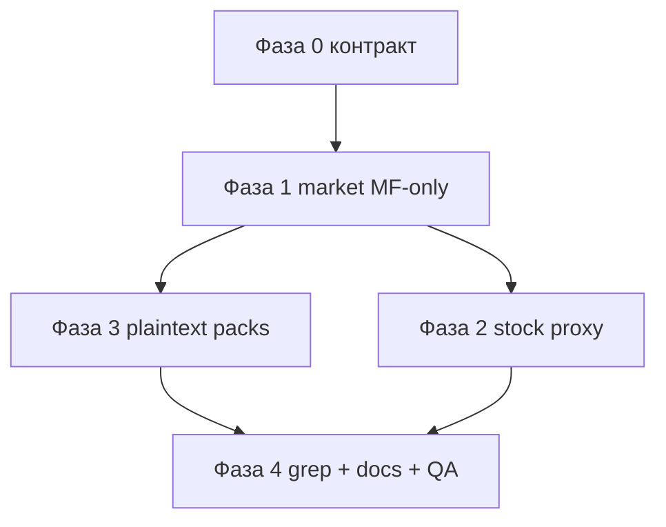

# Операция «Отречение» — задачи CEP (Spunkram Library)

План отказа CEP-панели от **`api.get-atomx.com`** / **`atomx.plus`** и полного перехода на **Motionflow next-app** + **R2 signed links**.

Зеркало по серверным задачам:  
`next-app/docs/operaciya-otrechenie.md`

Локальные пути: [`PATHS.md`](./PATHS.md). Текущий контракт API: [`BACKEND_CEP_API.md`](./BACKEND_CEP_API.md) (будет обновлён по ходу фаз).

---

## Цель для панели

| Сейчас | После «Отречения» |
|--------|-------------------|
| Каталог: `fetchMau` → get-atomx, merge с `/api/cep/market` | Только `GET /api/cep/market` |
| Footages: `external_lib_assets` + `track_download` на AtomX | `motionflow.pro/api/stock/*` |
| `API_SERVERS` / `MASKED.author` (SpunkramTemp) | Удалить AtomX bases; остаётся `client: spunkram-cep` |
| Decrypt BIN_AX / MG_ASSET при apply | Паки plaintext; install / ассеты по **signed URL**; settings на диске **без шифрования** |

Критерий: в `src/` нет URL `get-atomx.com` / `atomx.plus`; apply не вызывает `pack-protect` / decode encrypted assets.

---

## Точки отказа (инвентарь)

| Модуль | AtomX / legacy | Замена |
|--------|----------------|--------|
| `src/js/api/cep-market.ts` | `fetchMau` primary catalog | Только Motionflow market |
| `src/js/lib/api/market-api.ts` | `fetchMau`, `API_SERVERS` | Удалить или сузить до не-AtomX (если что-то ещё нужно — только MF) |
| `src/js/lib/config/masked.ts` | `API_SERVERS`, deprecated `author` | Убрать servers; `author` king больше не нужен |
| `src/js/footages/utils/fetchMedia.ts` | `external_lib_assets` | `/api/stock/unsplash` (+ pexels) |
| `src/js/footages/hooks/useImportMedia.ts` | `track_download` | stock download / attribution через next-app |
| `src/js/lib/utils/pack-protect.ts` | BIN_AX / MG_ASSET decode | Удалить из hot path |
| `src/js/lib/utils/pack-decode.ts` | Atom 3.0+ encrypted pack | Не использовать для новых паков |
| `src/js/lib/utils/pack-apply-paths.ts` + `apply-item.ts` | ветки `encrypted` | Только plaintext paths / скачанный cache |
| Docs `PATHS.md` / `BACKEND_CEP_API.md` | описание MAU | Обновить под единый market |

---

## Фазы CEP

### Фаза 0 — Контракт с next-app (P0)

- [ ] Сверить поля `CepMarketPackage` с финальным ответом `/api/cep/market` (без MAU-merge).
- [ ] Зафиксировать install flow: follow `install_url` → signed R2 (redirect или JSON `{ url, expires_in }`); обработка `403 NOT_OWNED` / `SUBSCRIPTION_REQUIRED`.
- [ ] Согласовать локальный формат «settings без шифрования»: что пишется в packages folder / `panel-store` / preferences после install.
- [ ] Обновить черновик в `BACKEND_CEP_API.md` § Market / Download (ссылка на операцию).

---

### Фаза 1 — Market только через Motionflow (P0)

- [ ] `loadMarket` / аналог: **убрать** `fetchMau` и dual-server fallback; один запрос `GET /api/cep/market?host=`.
- [ ] Удалить merge-логику MAU↔entitlements; UI кнопки Buy / Install брать из `action` / urls сервера.
- [ ] Убрать зависимость UI от AtomX-only полей, если их нет в MF-ответе (или попросить next-app добавить).
- [ ] Очистить `market-api.ts` от get-atomx; не оставлять мёртвый `API_SERVERS` в runtime.
- [ ] Убрать `MASKED.author` / king из любых запросов.
- [ ] Install: скачивание zip по signed URL → распаковка в packages dir; список установленных паков как сейчас (userdata / preferences), без encrypted sidecar.

**Выход:** Market tab работает offline от AtomX при доступном motionflow.pro.

---

### Фаза 2 — Footages → `/api/stock/*` (P1)

- [ ] Переписать `fetchMedia` на next-app stock routes (Bearer CEP token).
- [ ] Import / download: заменить `track_download` на контракт `/api/stock/download` (или аналог с attribution).
- [ ] Не хранить Unsplash/Pexels keys в CEP — только proxy.
- [ ] Обработать ошибки квоты / `RATE_LIMITED` понятным UI.
- [ ] QA: поиск, превью, импорт в AE/PR.

**Выход:** footages не трогают AtomX.

---

### Фаза 3 — Убрать дешифрование паков (P0/P1)

Сервер отдаёт plaintext + signed links; CEP больше не «ломает» защиту AtomX.

- [ ] Install path: ожидать plaintext `.mogrt` / `.aep` / `.prproj` (или как зафиксирует пайплайн публикации), не `.atomxasset` / `.mgasset` для новых паков.
- [ ] `apply-item` / `pack-apply-paths`: удалить ветки `BIN_AX` / `MG_ASSET` из основного flow (или оставить temporary legacy-read с предупреждением «переустановите пак»).
- [ ] Settings / structure JSON сохранять и читать **без** pack-decode encryption; путь — userdata / packages folder как согласовано.
- [ ] Online-ассеты (если apply без полной локальной копии): скачать по signed URL во временный cache → apply → (опционально) cleanup; не писать encrypted blobs.
- [ ] Документировать migration для уже установленных encrypted packs: «Remove package files» + Install заново из Market.
- [ ] Удалить неиспользуемые `pack-protect` / устаревшие decode helpers после cutover (или за флагом `LEGACY_ENCRYPTED_PACKS=0`).

**Выход:** apply path простой: resolve path → host apply; нет base64 decode.

---

### Фаза 4 — Cutover и чистка (P2)

- [ ] Grep по репо: ноль `get-atomx`, `atomx.plus`, `external_lib_assets`, `track_download`, `mau?king`.
- [ ] Обновить `docs/PATHS.md` (секция AtomX MAU → «устарело / удалено»).
- [ ] Обновить `BACKEND_CEP_API.md`: market без MAU; download = R2 signed; stock = `/api/stock`.
- [ ] QA checklist: login → market → install → switch pack → apply item → footages → update extension.
- [ ] Согласовать минимальную версию панели, с которой support считает AtomX unsupported.

---

## Рекомендуемый порядок работ в CEP

Блокирующая зависимость на next-app: **полный** `/api/cep/market` + working download presign до мержа «убрать MAU». Stock и decrypt-removal можно вести параллельно после контракта.

---

## Риски CEP

| Риск | Митигация |
|------|-----------|
| Пользователи с уже скачанными encrypted packs | Banner / settings CTA: reinstall from Market; temporary legacy decode |
| Signed URL истекает mid-download | Retry install; не кэшировать expired URL в preferences |
| CEP Node HTTP и 303 redirect на R2 | Явно follow redirects в `cep-http` / download helper |
| Расхождение mock market в DEV | Обновить `__CEP_API_MOCKS__` под новый shape без MAU |

---

## Чеклист готовности (CEP)

- [ ] Market без `fetchMau`
- [ ] Нет `API_SERVERS` AtomX в runtime
- [ ] Footages только через `/api/stock/*`
- [ ] Apply без decrypt для новых паков
- [ ] Docs PATHS + BACKEND обновлены
- [ ] QA на AE + PR пройден

---

## Связь с существующими docs

После реализации:

1. В `BACKEND_CEP_API.md` убрать «Primary catalog: get-atomx mau».
2. В `PATHS.md` заменить блок «AtomX MAU» ссылкой на этот файл («завершено»).
3. Держать оба `operaciya-otrechenie.md` (CEP ↔ next-app) в синхроне по статусу чеклистов.
