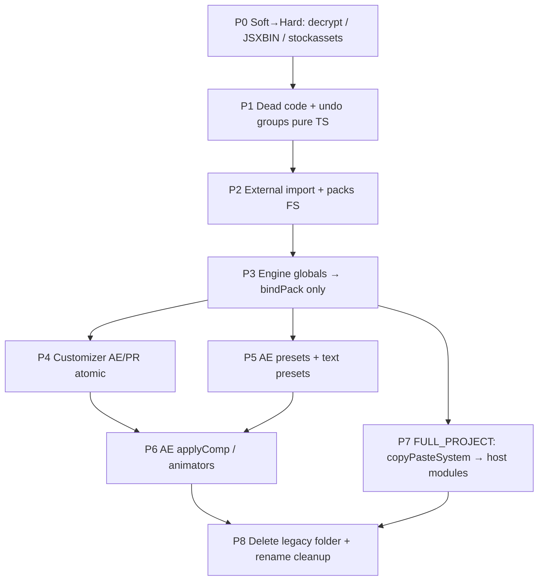

# Полное отречение — от legacy Beta к атомарному MotionFlow SDK

План вывода CEP с **`src/jsx/legacy/*`** (порт Spunkram Beta / Atom namespaces) на **полноценный host TS + публичный `MotionFlow.*`**, без `$._AtomExt_*`, `legacyAeCall` / `legacyPpCall` и runtime `loadLegacyJsx()`.

Связано с: [`../operaciya-otrechenie.md`](../operaciya-otrechenie.md) (API / Market / decrypt), [`INVENTORY.md`](./INVENTORY.md), [`PARITY.md`](./PARITY.md), [`AUTHOR_COOKBOOK.md`](./AUTHOR_COOKBOOK.md), [`../MOTIONFLOW_SDK.md`](../MOTIONFLOW_SDK.md).

---

## 1. Цель

| Сейчас | После полного отречения |
|--------|-------------------------|
| Bolt host TS + параллельный Beta JSX | Один host stack: `src/jsx/aeft|ppro|shared` |
| SDK обёртки → `legacy*Call` / `$._AtomExt_*` | SDK → только typed `evalTS` host exports |
| `loadLegacyJsx()` при старте и FULL_PROJECT | Нет `jsx/legacy` в dist |
| Atom имена внутри host | Только `$._MotionFlow` / Bolt namespace / публичный `MotionFlow` |
| Soft-legacy decrypt AtomX packs | Hard-remove (фаза 0, уже в «Отречении») |

**Критерий done:**

1. Папки `src/jsx/legacy/` нет; vite-плагин `copy-motionflow-legacy-jsx` удалён.
2. В `src/` нет `$._AtomExt_`, `legacyAeCall`, `legacyPpCall`, `loadLegacyJsx`, `transferExeSwitchTrigger`, `runPackageJSXBIN`.
3. Все операции из [`INVENTORY.md`](./INVENTORY.md) со статусом **ts** или **native-only** (не **wrapped** legacy).
4. QA AE + PR: Market install → apply (AEP / MOGRT / FULL_PROJECT / footage) → customizer → presets / animators → captions / styles.
5. `evalTS(` только в `src/js/sdk/` и `bolt.ts` (правило cookbook).

---

## 2. Что значит «атомарный» SDK

Не монолитный `aeComposer` / `ppComposer`, а **маленькие host-операции** с явным контрактом:

```
UI / authors
    → MotionFlow.<domain>.<op>(typed args) → MfResult<T>
        → evalTS("<op>", args)
            → src/jsx/{aeft|ppro|shared}/…  (одна ответственность)
```

Правила атомарности:

1. **Одна операция = один host export** (или тонкая оркестрация в JS SDK, не в 3k-строчном JSX).
2. **Typed args / result** в `src/js/sdk/types.ts` + зеркало в host.
3. **Host-agnostic UI** ветвится через `MotionFlow.host`, не через Atom globals.
4. **Оркестрация apply** живёт в JS (`apply-item.ts`, `copy-paste-apply.ts`), host даёт примитивы: import, find bin, place clip, undo group, copy/paste cmd.
5. **Никаких скрытых side-effects** через `_appTransferSets` / masked transfer — только явный `bindPack` / payload.

Целевой вид публичного API (эволюция текущего `MOTIONFLOW_SDK.md`):

```text
MotionFlow.loadHostScripts()          // только Bolt index.js
MotionFlow.bindPack / setEngine
MotionFlow.applyPackItem              // единственный apply entry (deprecate applyItem)
MotionFlow.customize.get|set
MotionFlow.packs.copyToAppData|deleteFiles   // TS already; drop runJsxbin
MotionFlow.importExternalAsset        // → AE/PPRO.importMedia primitives

MotionFlow.AE.*   // create*, applyComp*, animators, presets, tools, captions…
MotionFlow.PPRO.* // mogrt, import*, undoGroup, customize, tools, FULL_PROJECT primitives…
```

---

## 3. Карта зависимостей (что выпиливать в каком порядке)



Нельзя начинать с удаления `pp_composer.jsx` / `ae_composer.jsx`: на них сидят apply, customizer и `$._copyPasteSystem`.

---

## 4. Фазы

### Фаза 0 — Добить сетевое/крипто «Отречение» (параллельно, уже почти done)

**Зачем:** убрать второй смысл слова «legacy» (AtomX packs), чтобы SDK-миграция не тащила decrypt.

| Задача | Exit |
|--------|------|
| QA plaintext Market packs AE+PR | Checklist в `operaciya-otrechenie.md` |
| Hard-remove `pack-protect` / encrypted branches | Нет soft-decode path |
| Deprecate `MotionFlow.packs.runJsxbin` | Удалить метод + вызовы |

**Не трогает** `src/jsx/legacy/` composers — только crypto/API.

---

### Фаза 1 — Быстрые выпилы и стабилизация bridge

**Цель:** уменьшить поверхность legacy без смены UX.

| # | Работа | Замена | Удалить из `LEGACY_ORDER` |
|---|--------|--------|---------------------------|
| 1.1 | `stockassets.jsx` | уже `*-import-media.ts` | да |
| 1.2 | `undo_groups.jsx` | дописать pure TS в `ppro-sdk.ts` (сейчас fallback на `PremiereUndoGroups`) | да, когда TS покрывает start/end/abort + project-changed |
| 1.3 | Убрать dual-path в `copy-paste-apply` на `PremiereUndoGroups.*` string eval | `evalTS("undoGroupStart|End|Abort")` | — |
| 1.4 | Grep-gate CI (optional): forbid new `$._AtomExt_` outside `legacy/` | — | — |

**Exit:** `stockassets` + `undo_groups` не грузятся; FULL_PROJECT undo идёт через SDK undoGroup.

---

### Фаза 2 — External import + packs FS

| # | Работа | Замена |
|---|--------|--------|
| 2.1 | `external_lib_import.jsx` → `MotionFlow.AE|PPRO.importMedia` / place-on-timeline helpers | host TS |
| 2.2 | `MotionFlow.importExternalAsset` → thin wrapper над importMedia | без `$._AtomExt_externalLibAssetImporter` |
| 2.3 | Подтвердить: `mfCopyPackage` / `mfDeletePackage` не зависят от `engine.jsx` globals | уже в aeft-sdk / ppro-sdk |

**Exit:** `external_lib_import.jsx` удалён из loader.

---

### Фаза 3 — Engine: убрать глобальный apply / transfer

`engine.jsx` держит `applyItem`, `customizeHandler`, `transferExe*`, pack helpers, JSXBIN.

| # | Работа | Замена |
|---|--------|--------|
| 3.1 | Все UI apply → только `applyPackItem` / host-specific SDK (уже частично) | deprecate `MotionFlow.applyItem` |
| 3.2 | Убрать sync `transferExeSwitchTrigger` / `transferExeEngineSwitchTrigger` из `MotionFlow.bindPack` / `setEngine` | только `evalTS("bindPack"|"setEngine")` + shared state |
| 3.3 | Перенести оставшиеся engine-хелперы, нужные composers, во временный `src/jsx/shared/` **или** оставить до фаз 4–7 как last legacy file | — |
| 3.4 | Удалить `runPackageJSXBIN` path | фаза 0 |

**Стратегия:** `engine.jsx` удаляется **последним среди мелких** или вместе с composers, если applyComp всё ещё зовёт его globals. Не удалять раньше customizer/applyComp.

**Exit:** UI не вызывает `applyItem` / transferExe*; engine либо thin stub, либо gone.

---

### Фаза 4 — Customizer → атомарный API

Сейчас: `AE.customize.*` / `PPRO.customize.*` → `legacyAeCall` / `legacyPpCall` → огромные composers.

Целевой атомарный контракт (черновик):

```ts
// read
MotionFlow.customize.describeSelection(): MfResult<CustomizerSnapshot>
// write
MotionFlow.customize.setEffectParam(args)
MotionFlow.customize.setText(args)
MotionFlow.customize.setPseudoProp(args)
```

| # | Работа | Хост |
|---|--------|------|
| 4.1 | Спека `CustomizerSnapshot` (effects, texts, ranges, hide lists) — паритет с текущим JSON из Beta | shared types |
| 4.2 | AE: port `customizer` / `editCustomizer` кусками из `ae_composer.jsx` | `aeft-customize.ts` |
| 4.3 | PR: port `customizer` / `setCustomizeChanges` из `pp_composer.jsx` | `ppro-customize.ts` |
| 4.4 | SDK: убрать `legacy*Call` для customize | `ae.ts` / `ppro.ts` |
| 4.5 | Panel customizer UI smoke | — |

**Exit:** customizer работает без composers; composers ещё могут оставаться ради applyComp / copyPaste.

---

### Фаза 5 — AE presets + text presets + arabic

| Файл | SDK | Новый host |
|------|-----|------------|
| `ae_preset_manager.jsx` | `AE.applyPreset`, tools через preset manager | `aeft-presets.ts` |
| `ae_text_presets.jsx` | `AE.textPresets.*` | `aeft-text-presets.ts` |
| `additional.jsx` (arabic) | `AE.tools.formatArabic` (если есть) / tools | `aeft-text-arabic.ts` |

Портировать **по публичным методам**, не «файл целиком в один TS». Внутренние хелперы — private в том же модуле.

**Exit:** три файла убраны из `LEGACY_ORDER`; `evalES` с `$._AtomExt_aePresetManager` / `aeTextPresets` нет.

---

### Фаза 6 — AE applyComp + text/photo animators

Самый тяжёлый AE-кусок (`ae_composer.jsx` ~98 KB).

Разбить на атомы:

| Операция | Host module (предложение) |
|----------|---------------------------|
| Import AEP + place / duplicate structure | `aeft-apply-comp.ts` (расширить нынешний упрощённый `applyPackItem` PROJECT) |
| Folder / bin / naming / expression retarget | `aeft-comp-structure.ts` |
| Text animator pipeline | `aeft-text-animator.ts` |
| Photo animator + placeholder replace | `aeft-photo-animator.ts` |
| Timeline / time-remap / markers / blend | `aeft-layer-timing.ts` |
| Tools buttons (remove unused, etc.) | `aeft-tools.ts` |

Порядок внутри фазы:

1. Parity matrix: Beta `applyComp` options × Market pack types (что реально шлёт UI).
2. Port hot path Market packs first; niche Beta options — later или drop с документом breaking change.
3. Переключить `MotionFlow.AE.applyComp` / `addTextAnimator` / `addPhotoAnimator` / `tools.run` на `evalTS`.
4. Удалить `ae_composer.jsx` из loader.

**Exit:** AE pack apply + animators без legacy; `legacyAeCall` мёртв.

---

### Фаза 7 — Premiere FULL_PROJECT + остатки pp_composer

`pp_composer.jsx` (~118 KB) = customizer (уже в фазе 4) + **`$._copyPasteSystem`** + mogrt/relink leftovers.

| # | Работа | Примечание |
|---|--------|------------|
| 7.1 | Вынести `$._copyPasteSystem` API в `ppro-copy-paste.ts` (те же методы, что зовёт `copy-paste-apply.ts`) | native DLL остаётся — это **не** legacy JSX, а shipped bin |
| 7.2 | `copy-paste-apply.ts` → только `evalTS` примитивов / один `applyFullProject` host op | без `cps(\`$._copyPasteSystem...\`)` строк |
| 7.3 | Любые ещё живые `buttonActions` / track helpers | `ppro-tools.ts` |
| 7.4 | Убедиться: MOGRT/FOOTAGE/AUDIO не ходят в pp_composer | уже `ppro-apply-item.ts` |
| 7.5 | Удалить `pp_composer.jsx` | — |

**Exit:** FULL_PROJECT работает; `legacyPpCall` / `loadLegacyJsx` не нужны для PR.

Native `src/bin/win/Motionflow.dll` (+ Mac bundle) **остаётся** — это не Beta JSX. Документировать как `MotionFlow.PPRO.nativeCopyPaste` dependency.

---

### Фаза 8 — Снос legacy и финальный rename

| # | Работа |
|---|--------|
| 8.1 | Удалить `src/jsx/legacy/`, `legacy-loader.ts`, vite copy plugin |
| 8.2 | `MotionFlow.loadHostScripts` → только Bolt `reloadJSX` |
| 8.3 | Убрать aliases `$._AtomExt_*` → `$._MotionFlow` (больше не нужны) |
| 8.4 | Обновить `MOTIONFLOW_SDK.md`, `INVENTORY.md`, `PARITY.md`, `PATHS.md` |
| 8.5 | Grep gate в CI: `AtomExt|legacyAeCall|legacyPpCall|jsx/legacy` |
| 8.6 | (optional) group 7 rename внутренних символов / extension branding — отдельный PR |

**Exit:** критерии §1 выполнены.

---

## 5. Принципы портирования (чтобы не получить «legacy на TypeScript»)

1. **Сначала контракт, потом код** — зафиксировать args/result в `types.ts` и строку в INVENTORY со статусом `porting`.
2. **Feature flag / dual-run** на 1–2 релиза: `MotionFlow.AE.applyComp` может звать new host, при `MF_LEGACY_COMPOSER=1` — старый путь (или pack option). Снять flag в фазе 8.
3. **Не портировать мёртвые ветки** Beta (AtomX MAU, JSXBIN, encrypted) — сразу drop.
4. **Один PR = один атом или один legacy-файл из loader**, не «весь ae_composer».
5. **Parity tests:** где возможно — fixture pack + scripted apply; минимум — ручной QA checklist на фазу.
6. UI и авторы **никогда** не импортируют host paths — только `MotionFlow` ([cookbook](./AUTHOR_COOKBOOK.md)).

---

## 6. Definition of Done по фазам (чеклист)

- [ ] **P0** Hard-remove decrypt; `runJsxbin` gone; Market QA plaintext
- [ ] **P1** `stockassets` + `undo_groups` removed from loader
- [ ] **P2** `external_lib_import` removed; importExternalAsset = TS
- [ ] **P3** No `applyItem` / transferExe in UI path; engine thin or gone
- [ ] **P4** Customizer AE+PR на host TS
- [ ] **P5** Presets + text presets + arabic на host TS
- [ ] **P6** applyComp + animators + AE tools на host TS; `ae_composer` deleted
- [ ] **P7** `$._copyPasteSystem` в host TS; `pp_composer` deleted
- [ ] **P8** No `src/jsx/legacy`; docs + CI grep green

---

## 7. Оценка объёма (порядок)

| Фаза | Сложность | Ориентир |
|------|-----------|----------|
| 0–2 | S | дни |
| 3 | M | около недели |
| 4 | L | weeks (два host) |
| 5 | M–L | weeks |
| 6 | XL | largest AE effort |
| 7 | XL | largest PR effort + native |
| 8 | S | дни после зелёного QA |

Итого реалистично: **несколько итераций релизов**, не один big-bang. FULL_PROJECT и AE applyComp — критический путь.

---

## 8. Риски

| Риск | Митигация |
|------|-----------|
| Тихий регресс expression retarget / folder layout в AE | Fixture packs + side-by-side compare с Beta |
| FULL_PROJECT зависит от DLL + plug-ins | Не «переписывать native»; только JSX→TS обёртку |
| Customizer JSON shape сломает UI | Зафиксировать snapshot schema до порта; adapter если нужно |
| Слишком крупный PR | Жёстко: один legacy file / один atom per PR |
| Желание «просто удалить legacy» | Блокировать merge без exit criteria фазы |

---

## 9. Немедленные next steps (старт плана)

1. Закрыть **P0** QA plaintext + ticket на hard-remove decrypt.
2. PR **P1.1**: убрать `stockassets.jsx` из loader и репо.
3. PR **P1.2–1.3**: pure TS undo groups + перевести `copy-paste-apply` на `evalTS` undo.
4. Завести в `INVENTORY.md` колонку **Port target file** для каждой legacy-операции (таблица фаз 4–7).
5. Не начинать P6/P7, пока P4 customizer snapshot spec не согласован с UI.

---

## 10. Связь с предыдущим «Отречением»

| Операция «Отречение» | Полное отречение (этот док) |
|----------------------|----------------------------|
| Уход с AtomX API / MAU / encrypted packs | Уход с Atom ExtendScript composers |
| Soft→hard decrypt | Soft→hard: dual-run composer → pure SDK |
| Критерий: нет get-atomx URL | Критерий: нет `src/jsx/legacy` |

Оба нужны для продукта «только Motionflow»; этот документ — **host/SDK половина**.
